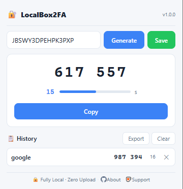

# LocalBox2FA

English | [中文](languages/README_zh.md) | [Español](languages/README_es.md) | [Deutsch](languages/README_de.md) | [日本語](languages/README_ja.md) | [Français](languages/README_fr.md)

A lightweight browser extension that generates TOTP 2FA verification codes — entirely locally, with zero data upload.

> Chromium-based · Manifest V3 · Fully Offline · Privacy First

---

## Why LocalBox2FA?

Most 2FA authenticators require a phone app or cloud sync. LocalBox2FA runs directly in your browser — no phone needed, no account required, no data ever leaves your machine.

| Advantage | Detail |
|-----------|--------|
| 🔒 **Fully Local** | All TOTP computation happens in your browser using Web Crypto API. Zero upload. |
| 📱 **No Phone Needed** | Generate 2FA codes right from your browser toolbar — no mobile app required. |
| 🚫 **No Account** | No registration, no cloud sync, no login. Just install and use. |
| ⚡ **Instant** | Codes generate in under 10ms. One click to copy to clipboard. |
| 🌙 **Dark Mode** | Automatically follows your system dark mode preference. |
| 🎯 **Minimal** | Under 50KB. No frameworks, no dependencies, no bloat. |

---

## Features

| Feature | Description |
|---------|-------------|
| 🔐 **TOTP Code Generation** | RFC 6238 compatible — accepts secret keys from Google Authenticator, Authy, and all standard TOTP services |
| ⏱️ **30s Countdown** | Visual progress bar with color transitions (blue → orange → red) |

---

## Compatibility Notice

This extension complies with RFC 6238 TOTP standard and supports secret keys generated by Google Authenticator, Authy and other mainstream 2FA tools. It is an independent tool and has no official affiliation with the above brands.

---

## Features (continued)
| 📋 **One-Click Copy** | Copy verification code to clipboard instantly |
| 💾 **Save & Manage** | Save secret keys with custom names, click to reload anytime |
| 📋 **Live History** | All saved accounts show real-time codes and countdown timers |
| 📤 **Export** | Export all secrets as a text file (name:secret format) for backup |
| 🗑️ **Safe Delete** | Confirmation dialog before deleting any record |
| 🔒 **Duplicate Guard** | Prevents saving the same secret key twice |
| 🌙 **Dark Mode** | Automatic dark/light theme based on system preference |
| 🌍 **6 Languages** | English, Chinese, Japanese, Spanish, German, French |

---

## Preview

<p align="center">
  
</p>

---

## Supported Browsers

| Browser | Status |
|---------|--------|
| Google Chrome | ✅ Fully supported |
| Microsoft Edge | ✅ Fully supported |
| Other Chromium-based browsers | ✅ Should work |

---

## Installation

1. Open your browser's extension page:
   - **Chrome**: `chrome://extensions/`
   - **Edge**: `edge://extensions/`
2. Enable **Developer mode** (top-right toggle)
3. Click **Load unpacked** and select the `local-box2-fa` folder
4. Click the 🔐 LocalBox2FA icon in your toolbar to start

---

## Usage

### Generate a Code

1. Click the LocalBox2FA icon in your toolbar
2. Paste your TOTP secret key (Base32 format) into the input field
3. Click **Generate** — a 6-digit code appears with a 30s countdown
4. Click **Copy** to copy the code to clipboard

### Save to History

1. After generating a code, click **Save**
2. Enter a name (e.g., "GitHub", "Google")
3. The account appears in your history list with a live code

### Use Saved Accounts

- All saved accounts show real-time codes and countdown timers
- Click any account to load its code into the main display
- Codes auto-refresh every 30 seconds

### Export & Backup

- Click **Export** to download all saved secrets as a `.txt` file
- Format: `AccountName:SecretKey` (one per line)
- Keep this file safe — it contains your secret keys

---

## How It Works

```
Enter secret key (Base32)
       ↓
Web Crypto API computes HMAC-SHA1
       ↓
Generates 6-digit TOTP code (RFC 6238)
       ↓
30-second countdown with auto-refresh
       ↓
One-click copy to clipboard
```

All computation happens locally using the browser's Web Crypto API. No network requests, no data upload.

---

## Privacy

LocalBox2FA is built with privacy as a core principle:

- ✅ **Zero data upload** — All TOTP computation happens locally
- ✅ **No analytics** — No tracking, no telemetry
- ✅ **No cookies** — No reading or writing of browser cookies
- ✅ **No network** — Extension works completely offline
- ✅ **Local storage only** — Secrets saved in browser localStorage, never leave your device
- ✅ **No permissions** — Manifest declares zero permissions

---

## ⚠️ Security Notes

**Please read carefully before use:**

- **🔑 Plaintext storage** — Secret keys are stored in browser `localStorage` **without encryption**. Anyone with access to your browser profile can view all saved keys.
- **💾 Clearing data = data loss** — Clearing browser cache or site data will **permanently erase** all saved accounts. Please export a backup file in advance.
- **📄 Export file is unencrypted** — The exported `.txt` backup contains plaintext secret keys. Store it securely and avoid public sharing.
- **🛡️ Best practice** — Delete saved secrets from the extension after transferring them to a dedicated authenticator app.

---

## License

Copyright © 2026 LocalBox2FA. All rights reserved.

---

## ❤️ Support

If you find LocalBox2FA helpful, consider supporting the project!

**[👉 Support LocalBox2FA](https://annmax1983.github.io/LocalBox2FA/)**
